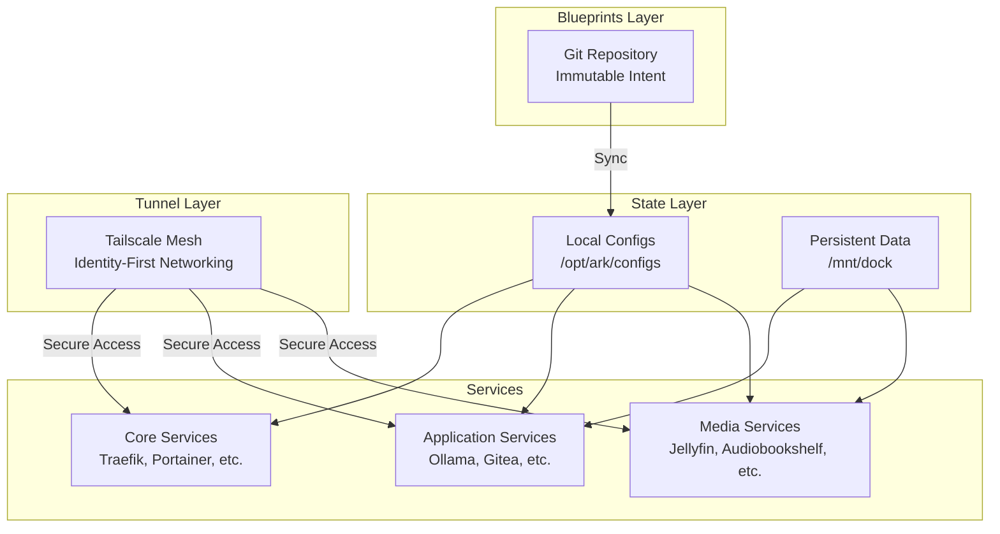

# ARK Node - Autonomous Edge Infrastructure

**"Software should be robust enough to run in the dark."**

**Version:** 3.1.0  
**Status:** **LTS (Long Term Support)**  
**Platform:** Edge Infrastructure Stack

> **LTS Declaration**
> 
> ARK Node v3.1.0 is the stable, feature-complete release. This version is frozen for long-term support. Future updates will strictly target security patches and critical constraint-driven fixes. No new features will be introduced to maintain maximum stability and deterministic behavior.

---

## What is ARK Node?

ARK Node is an **autonomous edge infrastructure platform** designed for constrained environments where traditional cloud assumptions fail: intermittent power, unreliable connectivity, and bare-metal deployments. It provides a complete, self-healing infrastructure stack with machine-readable status contracts, zero-dependency recovery, and deterministic state management.

**Core Philosophy:** Infrastructure should survive entropy. When power fails, networks drop, or you're operating in isolation, the system must recover autonomously without human intervention.

**Key Features:**
- **Machine-Readable Status Contract:** JSON API for automation and monitoring (`ark-manager.sh status --json`)
- **Zero-Dependency Recovery:** Self-healing containers with automatic restart policies
- **Deterministic State:** Pinned container versions ensure reproducible deployments
- **Profile-Based Architecture:** Modular service profiles (core, apps, media) for resource-constrained deployments

---

## Who This Is For

ARK Node is built for operators deploying infrastructure in **constrained edge environments** where traditional cloud-native solutions fail:

### ✔ Ideal Use Cases

- **Edge Computing Deployments** - Remote sites with unreliable connectivity and power
- **Field Operations** - Disaster response, research stations, remote construction sites
- **Zero-Trust Networks** - Identity-first networking via Tailscale mesh, no exposed ports
- **Autonomous Infrastructure** - Systems that must recover without human intervention
- **Resource-Constrained Environments** - Low-power devices, limited bandwidth, intermittent connectivity
- **Deterministic Deployments** - Reproducible infrastructure with pinned versions

### ✖ Not Recommended For

- **Beginners** - Requires Docker, networking, and Linux systems administration experience
- **Public Multi-Tenant Hosting** - Designed for single-operator or small team deployments
- **High-Compliance Enterprise** - Not certified for HIPAA, SOC2, or similar regulatory requirements
- **High-Performance Workloads** - Optimized for resilience and autonomy, not raw throughput
- **Cloud-Native Deployments** - Built for edge/offline scenarios, not cloud-first architectures

---

## Architecture

ARK implements a three-layer separation model:

### Blueprints (Git) → State (NVMe) → Tunnel (Tailscale)



**Key Principles:**
- **Blueprints** (Git): Immutable infrastructure definitions, version-controlled
- **State** (NVMe): Heavy, persistent data (SQLite DBs, media, models) stored locally
- **Tunnel** (Tailscale): Identity-first networking, no exposed ports, zero-trust access

This separation ensures:
- Infrastructure can be rebuilt from Git without losing data
- State survives blueprint changes
- Network access is identity-based, not IP-based

---

## Service Catalog

ARK organizes services into three profiles using Docker Compose profiles:

### Core Services (Required)

Essential infrastructure that provides the foundation:

| Service | Port | Purpose | Profile |
|---------|------|---------|---------|
| **Traefik** | 80 | Reverse proxy & routing | `core` |
| **Tailscale** | Host | Secure mesh networking | `core` |
| **Homepage** | 3000 | Main dashboard | `core` |
| **Portainer** | 9000 | Container management | `core` |
| **Syncthing** | 8384 | Device file sync | `core` |

**Deploy core only:**
```bash
COMPOSE_PROFILES=core docker compose up -d
```

### Application Services (Optional)

Development tools, AI, and productivity apps:

| Service | Port | Purpose | Profile |
|---------|------|---------|---------|
| **Ollama** | 11434 | Local LLM API | `apps` |
| **Open WebUI** | 3001 | AI chat interface | `apps` |
| **Kiwix** | 8083 | Offline Wikipedia | `apps` |
| **Gitea** | 3002 | Git repository hosting | `apps` |
| **Code-Server** | 8443 | VS Code in browser | `apps` |
| **Vaultwarden** | 8082 | Password manager | `apps` |
| **FileBrowser** | 8081 | Web file manager | `apps` |

**Deploy apps only:**
```bash
COMPOSE_PROFILES=core,apps docker compose up -d
```

### Media Services (Optional)

Entertainment and home automation:

| Service | Port | Purpose | Profile |
|---------|------|---------|---------|
| **Jellyfin** | 8096 | Media server | `media` |
| **Audiobookshelf** | 13378 | Audiobooks & podcasts | `media` |
| **Home Assistant** | 8123 | IoT automation | `media` |

**Deploy media only:**
```bash
COMPOSE_PROFILES=core,media docker compose up -d
```

**Deploy everything (default):**
```bash
COMPOSE_PROFILES=core,apps,media docker compose up -d
```

---

## Quick Start

**Want to get running fast?** → [📖 Quickstart Guide](/docs/getting-started/QUICKSTART.md)

### 3-Step Installation

```bash
# 1. Clone the repository
git clone <your-repo-url> /opt/ark
cd /opt/ark

# 2. Deploy the stack (all profiles)
./scripts/ark-manager.sh deploy

# 3. Access your dashboard
# Open: http://192.168.26.8:3000
```

**Default credentials**: `admin` / `arknode123`

### What Just Happened?

You just deployed:
- ✅ 16 containerized services across 3 profiles
- ✅ AI capabilities (Ollama + Open WebUI)
- ✅ Media server (Jellyfin + Audiobookshelf)
- ✅ File management (FileBrowser + Syncthing)
- ✅ Password manager (Vaultwarden)
- ✅ Home automation (Home Assistant)
- ✅ Development tools (Gitea + Code-Server)
- ✅ System monitoring (Portainer + Homepage)

**Next Steps:**
1. Complete setup wizards for each service
2. Download offline content (Wikipedia, survival guides, maps)
3. Configure Tailscale for remote access
4. Add your media files

**Detailed Instructions:** [Full Installation Guide](/docs/getting-started/INSTALLATION.md)

---

## The Ralph Loop: Autonomous Operations

ARK includes a modular management system called the **Ralph Loop** that handles deployment, health checks, healing, and documentation.

### Modular Commands

```bash
# Full autonomous loop (deploy → audit → heal → document)
./scripts/ark-manager.sh loop

# Individual commands
./scripts/ark-manager.sh deploy    # Sync blueprints, pull images, start services
./scripts/ark-manager.sh audit     # Health check all services
./scripts/ark-manager.sh heal      # Restart unhealthy containers
./scripts/ark-manager.sh document  # Backup configs and update logs
./scripts/ark-manager.sh status    # View current system state
```

### Self-Healing in Action

ARK's autonomous healing system detects and recovers from failures automatically. Here's how it works:

**Example Failure Scenario:**

1. **Detection**: During an audit, Ralph detects that the `jellyfin` container is in an "unhealthy" state:
   ```
   ❌ jellyfin container is RUNNING but UNHEALTHY
   ```

2. **Healing**: The heal command automatically restarts the container:
   ```
   ⚠️  jellyfin container is UNHEALTHY - attempting restart
   ✅ jellyfin container restarted
   ```

3. **Verification**: After healing, Ralph re-audits to confirm recovery:
   ```
   ✅ jellyfin container is ACTIVE (health check initializing)
   ```

4. **Documentation**: The entire cycle is logged to the Captain's Log for postmortem analysis.

**Key Features:**
- **Docker-native health checks**: Uses container health status, not HTTP guessing
- **State-aware auditing**: Distinguishes "Starting" vs "Dead" vs "Healthy"
- **Automatic recovery**: Restarts unhealthy containers without human intervention
- **Comprehensive logging**: All events logged for troubleshooting

This is not overengineering—this is operational maturity for environments where you can't always be present to fix issues manually.

---

## Storage Strategy

ARK uses a two-tier storage approach:

- **Local SSD** (`/opt/ark/configs`): SQLite databases, service configs, lightweight state
- **CIFS Mount** (`/mnt/dock`): Media files, AI models, large data, persistent state

This separation ensures:
- Critical configs survive network mount failures
- Heavy data can be stored on network storage
- SQLite databases avoid corruption from network filesystems

---

## Network Architecture

- **Static IP**: 192.168.26.8 (configurable)
- **Domain**: *.ark.local (via local DNS or hosts file)
- **Bridge network**: `ark_network` (isolated Docker network)
- **Tailscale Mesh**: Identity-first remote access, no exposed ports

### Remote Access via Tailscale

ARK uses Tailscale for secure, zero-trust remote access:

1. **No exposed ports**: Services are only accessible via Tailscale mesh
2. **Identity-based**: Access controlled by Tailscale ACLs, not firewall rules
3. **Automatic routing**: Works from anywhere, no VPN configuration needed

---

## Configuration

### Ralph Protocol

ARK implements the **Ralph Protocol** for consistency:
- Standardized port assignments
- Golden credentials (admin/arknode123)
- Persistent storage paths
- Health monitoring
- Auto-healing

### First-Time Setup

After deployment, complete these setup wizards:
1. **Portainer** (http://192.168.26.8:9000) - Create admin (12+ chars)
2. **Home Assistant** (http://192.168.26.8:8123) - Onboarding wizard
3. **Jellyfin** (http://192.168.26.8:8096) - Media library setup
4. **Vaultwarden** (http://192.168.26.8:8082) - Create first account
5. **Gitea** (http://192.168.26.8:3002) - Initialize admin account
6. **Code-Server** (http://192.168.26.8:8443) - Enter password (arknode123)

---

## CI/CD Integration

ARK supports automated deployments via GitHub Actions using Tailscale:

```yaml
# .github/workflows/deploy.yml
- name: Deploy ARK
  run: |
    ssh ark-node "./scripts/ark-manager.sh loop"
```

The deployment:
- Enters the Tailscale mesh (no exposed ports)
- Targets a specific node
- Runs the full Ralph Loop
- Fails the commit if services don't come up healthy

This is real CI, not theater.

---

## Documentation

**📚 [Complete Documentation](/docs/README.md)**

- **[Quickstart Guide](/docs/getting-started/QUICKSTART.md)** - Get running in 10 minutes
- **[Installation Guide](/docs/getting-started/INSTALLATION.md)** - Platform-specific setup
- **[Security Setup](/docs/guides/SECURITY_SETUP.md)** - Tailscale, ACLs, hardening
- **[Port Forwarding](/docs/guides/PORT_FORWARDING_SETUP.md)** - Network configuration
- **[GitHub Actions Setup](/docs/guides/GITHUB_ACTIONS_SETUP.md)** - CI/CD integration

---

## Project Structure

```
/opt/ark/
├── docker-compose.yml       # Main stack definition (with profiles)
├── scripts/
│   └── ark-manager.sh      # Modular CLI manager (deploy, audit, heal, document)
├── configs/                # Service configurations (local SSD)
│   ├── homepage/          # Dashboard config
│   ├── portainer/         # Container management data
│   ├── jellyfin/          # Media server config
│   ├── gitea/             # Git server config
│   └── ...
├── docs/                   # Documentation
├── VERSION                 # Semantic version
└── README.md              # This file

/mnt/dock/                 # CIFS shared storage
├── data/                  # Service data
│   ├── media/            # Media files
│   ├── models/           # Ollama AI models
│   └── sync/             # Syncthing shared folders
```

---

## Content Download Scripts

ARK includes automated content acquisition scripts in `/opt/ark/scripts/`:

### Available Scripts

**download-wikipedia.sh** - Download Wikipedia ZIM files for Kiwix
```bash
# Interactive mode
/opt/ark/scripts/download-wikipedia.sh

# Unattended mode (90GB, run overnight)
/opt/ark/scripts/download-wikipedia.sh --unattended
```

**download-survival.sh** - Download survival and emergency guides
```bash
/opt/ark/scripts/download-survival.sh --all
```

**download-maps.sh** - Download OpenStreetMap data for OsmAnd
```bash
/opt/ark/scripts/download-maps.sh --starter
```

**download-books.sh** - Download Project Gutenberg and educational content
```bash
/opt/ark/scripts/download-books.sh --essential
```

**check-downloads.sh** - Monitor active downloads and content status
```bash
/opt/ark/scripts/check-downloads.sh
```

### Running Downloads in Background

For large downloads (like Wikipedia), use nohup:
```bash
nohup /opt/ark/scripts/download-wikipedia.sh --unattended > /tmp/wikipedia-download.log 2>&1 &

# Check progress
tail -f /tmp/wikipedia-download.log
```

---

## Known Issues

- **FileBrowser**: Auth database requires reset on first run
- **Kiwix**: Requires manual .zim file downloads
- **Portainer**: Requires 12+ character password
- **Tailscale**: May require authentication via `docker exec`

See `CHANGELOG.md` for complete list.

---

## Contributing

See `CONTRIBUTING.md` for guidelines.

---

## Project Nomad

**ARK** is the software component of **Project Nomad**, a mission to provide resilient, off-grid capable computing for digital nomads and remote locations.

- **Project Nomad**: The mission (off-grid resilience)
- **ARK**: The software (this repository)
- **Nomad Node**: The hardware platform (VM/physical device)

Learn more: [tylereno.me](https://tylereno.me)

---

## License

See `LICENSE` file for details.

---

## Support

- **Documentation**: `/mnt/dock/docs/`
- **Issues**: GitHub Issues
- **Discussions**: GitHub Discussions

---

**Built with ❤️ for digital nomads everywhere.**
